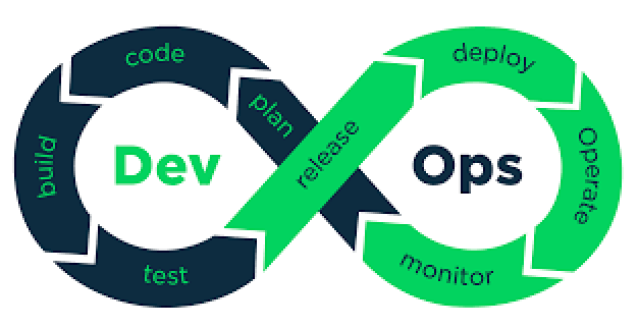

  

# 👋 Hi, I'm Ajay Varghese  
**DevOps & Cloud Engineer**

I am a Mechanical Engineering graduate from Pune University with a PGDM in Operations Management. I began my career with Tech Mahindra in August 2018 and grew into a Team Leader role by November 2022, leading UK sales operations, driving performance, coaching teams, and managing client-focused deliverables in a fast-paced environment.

I am now transitioning into IT to build a career in Cloud and DevOps. I work with AWS Cloud, Linux Administration, Git & GitHub, Jenkins CI/CD, Maven, Docker, Docker Compose, Kubernetes, Terraform, Ansible, Prometheus, and Grafana, focusing on automation, cloud infrastructure, and modern DevOps practices.

I continue strengthening my skills through hands-on labs, real-world capstone projects, and continuous learning.

---

## 🔧 Tools & Technologies I Work With

### ☁️ Cloud
- **AWS** — EC2, S3, IAM, VPC, Load Balancers, Auto Scaling, CloudWatch, Route 53

### 🏗️ Infrastructure as Code
- **Terraform** — providers, variables, count, EC2, S3, VPC basics

### 🐳 Containers & Orchestration
- **Docker** — images, containers, volumes, Dockerfile, Hub, Compose  
- **Kubernetes** — Pods, ReplicaSets, Deployments, Services, Rolling Update, Rollback, Scaling

### 🔁 CI/CD & Automation
- **Jenkins** — pipelines, Maven build, deploy WAR to Tomcat  
- **GitHub Actions** — basic pipelines

### ⚙️ Configuration Management
- **Ansible** — playbooks, roles, vault, ad-hoc automation

### 📦 Build & Deploy
- **Maven**, **Tomcat**

### 🖥️ Operating System
- **Linux** — users, groups, SSH, SCP, permissions, find/grep, shell scripting

### 🔧 Version Control
- **Git & GitHub** — branches, stash, cherry-pick, PRs, conflicts, restore, reset

### 📊 Monitoring & Metrics
- **Prometheus** — installed & configured (targets, exporters, metrics)  
- **Grafana** — dashboards, data source setup, basic visualization

---

## 📘 Quick Summary  
I practice end-to-end DevOps workflows:

1. Build app with **Maven**  
2. Create container with **Docker**  
3. Deploy with **Kubernetes**  
4. Automate infra with **Terraform**  
5. Automate config with **Ansible**  
6. CI/CD using **Jenkins / GitHub Actions**  
7. Monitor using **Prometheus & Grafana**  
8. Host everything on **Linux + AWS**

---

## 📈 GitHub Stats  

---

## 📫 Contact  
**LinkedIn:** *(add link here)*
